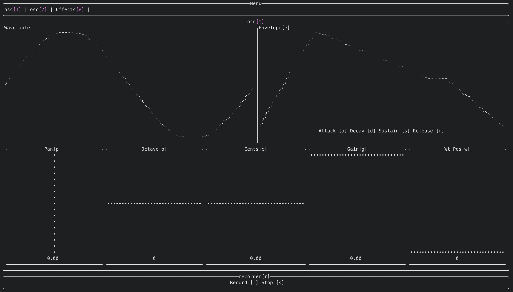

# oosc-rs

oosc-rs is an additive wavetable synthesizer for terminal.



## Controls
Press char that at [] braces to make component focused and active. 
h, l - to decrease/increase value of parameter
j, k - to move between some parameters(eg. when Envelope component active)
Esc - to unfocus current component and focus on parent

## Features
- Additive
- Wavetable
- Runs on terminal
- Load and Play midi files
- Read and Play raw midi-in
- Load fixed-chunk wavetable from any wav-file
- Automatization(currentry unavailable from UI, only API)
- Synthesizer output Effect(currently not supported API's like VST etc.)
- Safe Multi-thread with rayon
- Real-time parameters change with keyboard
- Edit ADSR envelopes with Bezier curves
- Low-frequency oscillators

## Built-in Effects
- Amplifier, Chorus, Compressor, Delay, Filters & EQ(1st, 2nd order Butterworth & more, + 3rd order filter API)

## Build

```bash
cargo build --release
```

## Requirements

- Stable Rustc 
- OS that cpal supports
